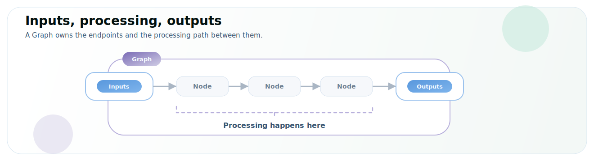
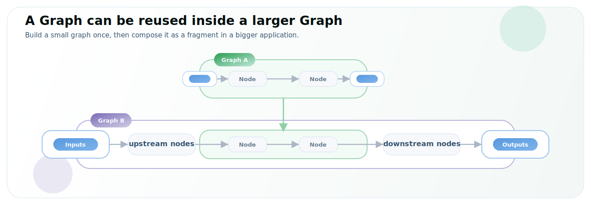

# Graph

In SiMa.ai Neat, the `Graph` [API](/reference/{lsa}/classes/simaai-neat-graph) is how you compose an application. A `Graph` describes a flow of connected nodes, from the inputs where data enters, through the processing nodes in the middle, to the outputs where results are produced. If you come from ML, think of a `Graph` like a small model graph.

- Frames, tensors, or samples enter through **inputs** and leave through **outputs**. Processing happens in the middle through **nodes** such as decode, resize, preprocess, inference, postprocess, branching, and custom logic.



- Graphs can run standalone or be reused inside a larger graph.



Neat is designed so you spend your time describing the application, not building the runtime plumbing by hand. The SDK provides pre-built [nodes](/develop-apps/development-workflow/node) and [node groups](/develop-apps/development-workflow/node#pre-built-node-groups) for common work such as input, decode, resize, preprocess, inference, postprocess, and output. These nodes automatically map to efficient, hardware-accelerated parts of the SoC where applicable. In a `Graph`, you declare which nodes to use, set their parameters, and connect them in the order your application needs.

Underneath, Neat builds the executable runtime graph on GStreamer. Neat abstracts that implementation away, so you use the public `Graph` API instead of managing GStreamer elements, `appsrc`, `appsink`, queues, or internal runtime ports.

## Nodes, groups, and boundaries

A `Graph` is the assembly boundary; [`Node`](/develop-apps/development-workflow/node) is the building block.

That includes:

- atomic nodes such as decode, preprocess, postprocess, source, and sink stages;
- pre-built node groups, which are reusable bundles of nodes;
- boundary nodes such as `Input("image")` and `Output("classes")`.

For the detailed rules around pre-built groups and boundary nodes, see [Node → Pre-built node groups](/develop-apps/development-workflow/node#pre-built-node-groups) and [Node → Boundary nodes](/develop-apps/development-workflow/node#boundary-nodes).

When you call `Graph::build()`, Neat lowers the public graph into one executable runtime graph, preserving endpoint names for diagnostics and named `Run` APIs.

## Naming inputs and outputs

Names on `Input` and `Output` nodes declare the boundary endpoints of a Graph fragment. Boundaries that remain on the outside of the final composed `Graph` become public runtime endpoints:

```cpp
simaai::neat::Graph classifier("classifier");
classifier.add(simaai::neat::nodes::Input("image"));
classifier.add(model);
classifier.add(simaai::neat::nodes::Output("classes"));
```

Here, `image` is the input endpoint and `classes` is the output endpoint. The Graph name, `classifier`, is only a label for diagnostics and visualization; it does not create an input or output.

## Composing graphs

### The shortest mental model

To compose an application, declare a `Graph`, then use `add()` for a linear chain or `connect()` for explicit topology:

- Use `add()` for common single-path processing, such as a simple single-model inference.
- Use `connect()` when you need explicit control over how nodes or fragments are connected.

```cpp
simaai::neat::Graph g;
g.add(...);      // continue the same linear chain
g.connect(...);  // add explicit graph topology

auto run = g.build();
```

### Build using `add()`

The following example reads an image, runs inference, and outputs the predicted classes from the model.

```text
image -> model inference -> classes
```

Here is what the code would look like:

```cpp
simaai::neat::Model model("resnet50.tar.gz");  // Load a compiled model and prepare its Graph route.

simaai::neat::Graph g("classifier");           // instantiate the Graph that will describe the app
g.add(simaai::neat::nodes::Input("image"));    // adds an input Node named "image"
g.add(model);                                  // adds the model Nodes connected to the Input
g.add(simaai::neat::nodes::Output("classes")); // adds an output Node named "classes" connected to 'model'

auto run = g.build();                          // build the Graph
```

:::note
Use `add()` to append nodes in a simple linear sequence, following the previously added node.
:::

### Build using `connect()`

Use `connect()` when you need explicit control over the topology. Each `add()` initially connects the new node or fragment after the previous one. When you use both methods, `connect()` replaces the relevant implicit connections with the specific connections you declare. You can also use `connect()` directly between named endpoints, nodes, models, or reusable Graph fragments.

#### Fan-out using `connect()`

A fan-out sends one input to more than one output. First add the endpoints so they exist in the graph:

```cpp
simaai::neat::Graph fan_out_graph("fan_out_graph");
fan_out_graph.add(simaai::neat::nodes::Input("image_input"));
fan_out_graph.add(simaai::neat::nodes::Output("original_image"));
fan_out_graph.add(simaai::neat::nodes::Output("model_image"));
```

Conceptually `fan_out_graph` would look like this:

```text
image_input --> original_image --> model_image
```

Then use `connect()` to replace the default linear wiring with the topology you want:

```cpp
fan_out_graph.connect("image_input", "original_image");
fan_out_graph.connect("image_input", "model_image");
```

Conceptually `fan_out_graph` would now look like this:

```text
            /--> original_image
image_input
            \--> model_image
```

#### Using `Branch()`

Because fan-out is common, Neat provides [`graphs::Branch()`](/reference/{lsa}/namespaces/simaai-neat-graphs#a1feffc304100fd17cb99c5f5bff3c20c) as a helper. This creates the input, the outputs, and the `connect()` calls internally:

```cpp
auto fan_out_graph = simaai::neat::graphs::Branch(
    "image_input",
    {"original_image", "model_image"});
```

`fan_out_graph` is still an ordinary `Graph` fragment. You can connect it into a larger application like any other `Graph`.

:::note
Branching can introduce backpressure. If one branch stops consuming data, it can slow or block the producer depending on the selected runtime policy. `Branch()` makes the fan-out explicit instead of hiding it behind accidental duplicate outputs.
:::

#### Fan-in using `connect()`

A fan-in sends multiple inputs into one output. Unlike a simple fan-out, a fan-in must also declare how samples are matched. That policy lives on the output endpoint.

First configure the output and add the endpoints so they exist in the graph:

```cpp
simaai::neat::OutputOptions render_options;
render_options.combine_policy = simaai::neat::CombinePolicy::ByFrame;

simaai::neat::Graph render_inputs_graph("render_inputs_graph");
render_inputs_graph.add(simaai::neat::nodes::Input("image"));
render_inputs_graph.add(simaai::neat::nodes::Input("bbox"));
render_inputs_graph.add(simaai::neat::nodes::Output("render_inputs", render_options));
```

Conceptually `render_inputs_graph` would look like this:

```text
image -> bbox -> render_inputs
```

Then use `connect()` to replace the default linear wiring with the topology you want:

```cpp
render_inputs_graph.connect("image", "render_inputs");
render_inputs_graph.connect("bbox", "render_inputs");
```

Conceptually `render_inputs_graph` would now look like this:

```text
image ----\
           render_inputs
bbox -----/
```

#### Using `Combine()`

Because fan-in is common, Neat provides [`graphs::Combine()`](/reference/{lsa}/namespaces/simaai-neat-graphs#a6f1479674758179a4bbd72af1291ea47) as a helper. This creates the inputs, the output, the combine policy, and the `connect()` calls internally:

```cpp
auto render_inputs_graph = simaai::neat::graphs::Combine(
    {"image", "bbox"},
    "render_inputs",
    simaai::neat::CombinePolicy::ByFrame);
```

`render_inputs_graph` is still an ordinary `Graph` fragment. You can connect it into a larger application like any other `Graph`.

:::note
`CombinePolicy` tells Neat how to match incoming samples:

- `ByFrame`: combine samples with the same `frame_id`.
- `ByPts`: combine samples with the same presentation timestamp (`pts_ns`).
- `None`: do not combine multiple producers; the graph fails and asks for an explicit policy.

There is no hidden fallback. With `ByFrame`, missing frame IDs are an error. With `ByPts`, missing timestamps are an error. This prevents Neat from silently combining the wrong samples.
:::

### Complete branching and merging example

Now put the pieces together. The input image is split into two paths. One path goes through the model and produces bounding boxes. The other path keeps the original image available for a later render stage.

```text
           /--> model_image -> model -> bbox --\
image_input                                     render_inputs
           \----------------> original_image --/
```

At a high level, follow these steps:

1. First declare the input fan-out `Graph` fragment
2. Create the model inference `Graph` fragment that consumes `model_image` and produces `bbox`
3. Combine the original image path and the `bbox` path into `render_inputs`
4. Connect them all together into a final `Graph` called `app`

#### Constructing the branching and merging example

1. First create the fan-out using `Branch()` as seen above:

    ```cpp
    auto image_input_graph = simaai::neat::graphs::Branch(
        "image_input",
        {"model_image", "original_image"});
    ```

    `image_input_graph` will then be constructed as:

    ```text
                /--> original_image
    image_input
                \--> model_image
    ```

2. Create the `model_inference_graph`:

    ```cpp
    simaai::neat::Graph model_inference_graph("model_inference_graph");
    model_inference_graph.add(simaai::neat::nodes::Input("model_image"));
    model_inference_graph.add(model);
    model_inference_graph.add(simaai::neat::nodes::Output("bbox"));
    ```

    `model_inference_graph` will then be constructed as:

    ```text
    model_image --> model --> bbox
    ```

    :::note
    This example assumes the selected model route emits decoded BBOX data. If the model emits raw inference tensors, add a model-specific `SimaBoxDecode` stage before `Output("bbox")`.
    :::

3. Then create the fan-in `render_graph`:

    ```cpp
    auto render_graph = simaai::neat::graphs::Combine(
        {"original_image", "bbox"},
        "render_inputs",
        simaai::neat::CombinePolicy::ByFrame);
    ```

    `render_graph` will then be constructed as:

    ```text
    original_image ----\
                        render_inputs
    bbox --------------/
    ```

4. Finally, connect the fragments into a single `Graph` to construct the entire application:

    ```cpp
    simaai::neat::Graph app("app");
    app.connect(image_input_graph, model_inference_graph);
    app.connect(image_input_graph, render_graph);
    app.connect(model_inference_graph, render_graph);
    ```

**The full example:**

```cpp
simaai::neat::Model model("yolov8s_model.tar.gz");

auto image_input_graph = simaai::neat::graphs::Branch(
    "image_input",
    {"model_image", "original_image"});

simaai::neat::Graph model_inference_graph("model_inference_graph");
model_inference_graph.add(simaai::neat::nodes::Input("model_image"));
model_inference_graph.add(model);
model_inference_graph.add(simaai::neat::nodes::Output("bbox"));

auto render_graph = simaai::neat::graphs::Combine(
    {"original_image", "bbox"},
    "render_inputs",
    simaai::neat::CombinePolicy::ByFrame);

simaai::neat::Graph app("app");
app.connect(image_input_graph, model_inference_graph);
app.connect(image_input_graph, render_graph);
app.connect(model_inference_graph, render_graph);

auto run = app.build();

auto image_sample =
    simaai::neat::make_tensor_sample("image_input", image_tensor);
image_sample.frame_id = 0;
run.push("image_input", image_sample);

auto inputs = run.pull("render_inputs");
```

The executable example stops at `render_inputs`, which contains the matching `original_image` and `bbox` values. A downstream render or output node can consume that combined result, then save the rendered image to a file, display it, or send it elsewhere.

## Using named endpoints at runtime

After a `Graph` is built, the same endpoint names are used to send data in and read results out.

When a Graph has multiple public inputs or outputs, pass the endpoint name to `push()` or `pull()`:

```cpp
run.push("image", simaai::neat::TensorList{image_tensor});
run.push("metadata", simaai::neat::TensorList{metadata_tensor});

auto classes = run.pull("classes");
auto preview = run.pull("preview");
```

For a Graph with exactly one public input or output, the name is optional at runtime:

```cpp
run.push(simaai::neat::TensorList{image_tensor});
auto classes = run.pull();
```

If more than one input or output is available, an unnamed `push(...)` or `pull()` fails and lists the available endpoint names instead of guessing which one you intended.

## Practical examples

### Reusable model route

```cpp
simaai::neat::Graph make_classifier(simaai::neat::Model& model) {
  simaai::neat::Graph classifier_route("classifier");           // create a reusable Graph fragment
  classifier_route.add(simaai::neat::nodes::Input("image"));    // declare the fragment's input
  classifier_route.add(model);                                  // add the model inference route
  classifier_route.add(simaai::neat::nodes::Output("classes")); // declare the fragment's output
  return classifier_route;                                      // return the fragment for reuse
}
```

Use by itself:

```cpp
auto classifier_route = make_classifier(model);      // create the classifier fragment
auto run = classifier_route.build();                 // build it as a standalone application
run.push("image", simaai::neat::TensorList{image});  // send data to its named input
auto classes = run.pull("classes");                  // read from its named output
```

Use inside a larger app:

```cpp
simaai::neat::Graph app("app");            // create the larger application Graph
app.connect(camera, classifier_route);     // connect the camera fragment to the classifier
app.connect(classifier_route, telemetry);  // forward classification results to telemetry
```

In the larger app, the classifier route's boundary nodes are internal declarations. They do not become extra public push/pull endpoints unless they are still on the outside of the final graph.

### Pass-through adapter

Sometimes a fragment only renames a boundary:

```cpp
simaai::neat::Graph adapter("adapter");            // create a reusable adapter fragment
adapter.add(simaai::neat::nodes::Input("raw"));    // declare the incoming endpoint name
adapter.add(simaai::neat::nodes::Output("image")); // declare the outgoing endpoint name
adapter.connect("raw", "image");                   // pass data directly between the endpoints
```

When used inside another graph, this can compile down to a direct wire. Neat keeps the names for readability and diagnostics, but it does not create useless runtime work.

## Best practices

### Endpoint naming

Choose endpoint names that describe their meaning in the application:

```cpp
nodes::Input("image");          // describes the data entering the Graph
nodes::Input("left_camera");    // identifies the input's application role
nodes::Output("classes");       // describes a classification result
nodes::Output("detections");    // describes a detection result
nodes::Output("preview");       // describes the output's intended use
```

Avoid names based on internal runtime details:

```cpp
nodes::Input("appsrc0");  // exposes an internal GStreamer implementation detail
nodes::Output("sink1");   // describes runtime plumbing instead of application meaning
nodes::Output("out");     // acceptable for small tests, but unclear in applications
```

If a fragment contains several unnamed outputs, Neat assigns deterministic suffixes such as `classes_0`, `classes_1`, and `classes_2`. Prefer explicit names in application code.

### Rules of thumb

- Use `Graph` for applications and reusable fragments.
- Use `Model` directly in `Graph::add(model)` when you want the model's normal route.
- Use named `Input` and `Output` nodes to declare the public contract of a fragment.
- Use `add()` for a straight chain.
- Use `connect()` for explicit topology and fragment composition.
- Use named `run.push("name", ...)` and `run.pull("name")` for multi-input or multi-output apps.
- Declare the [nodes](/develop-apps/development-workflow/node), [node groups](/develop-apps/development-workflow/node#pre-built-node-groups), parameters, and connections your application needs; let Neat handle the low-level runtime details.

## See also

- [Node](/develop-apps/development-workflow/node)
- [Model](/develop-apps/development-workflow/model)
- [Public Graph and graph helpers](/develop-apps/advanced-concepts/graphs)

## Tutorials

- [Build a Custom Data Graph](/tutorials/build-a-custom-data-graph)
- [Embed a Model Inside a Graph](/tutorials/embed-model-inside-graph)
- [Run Multiple Streams in One Graph](/tutorials/run-multiple-streams)
