# PCIe Co-Processing



PCIe co-processing keeps application control and input preparation on the host
machine while a connected Modalix PCIe Card executes the model. In this example,
the host reads, resizes, and normalizes an image, sends the prepared tensor to
the card for ResNet-50 inference, and prints the returned classification output.

## Before you begin

You need:

- the [Neat PCIe host package](/getting-started/neat-library/pcie-host/)
  installed on the host machine;
- a compatible Neat Library release installed on the card; and
- the card management interface reachable from the host. Card 0 uses
  `10.0.0.2` by default.

## Get the model and image

Create a working directory on the host machine and download ResNet-50 from the
Model Zoo:

<ShellCommand prompt="pcie-host">
sudo apt-get install python3-opencv libopencv-dev
mkdir -p pcie-host-quickstart/assets
cd pcie-host-quickstart
sima-cli modelzoo get resnet_50
</ShellCommand>

Place the downloaded archive in this directory as `resnet_50.tar.gz`.

Download the [sample image](../../images/tutorial_sample_image.png) and save it
as `assets/sample.png`.

Your working directory should now contain:

```text
pcie-host-quickstart/
├── assets/
│   └── sample.png
└── resnet_50.tar.gz
```

## Create the application

Choose Python or C++ and create the application in the working directory.

<CodeTabs>
<CodeTab label="Python" lang="python">

Create `pcie_host.py`:

```python title="pcie_host.py"
import cv2
import numpy as np

import pyneatpcie as pcie


def load_input(path):
    bgr = cv2.imread(path, cv2.IMREAD_COLOR)
    if bgr is None:
        raise RuntimeError(f"failed to read image: {path}")
    bgr = cv2.resize(bgr, (224, 224), interpolation=cv2.INTER_AREA)
    rgb = cv2.cvtColor(bgr, cv2.COLOR_BGR2RGB).astype(np.float32) / 255.0
    mean = np.array([0.485, 0.456, 0.406], dtype=np.float32)
    stddev = np.array([0.229, 0.224, 0.225], dtype=np.float32)
    return (rgb - mean) / stddev

connection = pcie.ConnectionOptions(
    card_host="10.0.0.2",
    card_id=0,
    queue=0,
)

with pcie.Model("resnet_50.tar.gz", connection=connection) as model:
    input_spec = model.info().inputs[0]
    input_tensor = pcie.Tensor.from_numpy(
        load_input("assets/sample.png"),
        copy=True,
        route_name=input_spec.name,
    )
    model.build(readiness_timeout_ms=180000)
    outputs = model.run([input_tensor], timeout_ms=30000)

output = outputs[0].to_numpy().reshape(-1)
print("output:", outputs[0].route.name, outputs[0].shape)
print("top1:", int(np.argmax(output)))
```

</CodeTab>
<CodeTab label="C++" lang="cpp">

Create `pcie_host.cpp`:

```cpp title="pcie_host.cpp"
#include <simaai/neat/pcie/Model.h>

#include <opencv2/imgcodecs.hpp>
#include <opencv2/imgproc.hpp>

#include <algorithm>
#include <cstdint>
#include <iostream>
#include <iterator>
#include <stdexcept>
#include <string>
#include <utility>
#include <vector>

namespace pcie = simaai::neat::pcie;

pcie::Tensor load_input(const std::string& path,
                        const std::string& route_name) {
  cv::Mat bgr = cv::imread(path, cv::IMREAD_COLOR);
  if (bgr.empty())
    throw std::runtime_error("failed to read image: " + path);

  cv::resize(bgr, bgr, cv::Size(224, 224), 0, 0, cv::INTER_AREA);
  cv::Mat rgb;
  cv::cvtColor(bgr, rgb, cv::COLOR_BGR2RGB);
  if (!rgb.isContinuous())
    rgb = rgb.clone();

  constexpr float mean[] = {0.485F, 0.456F, 0.406F};
  constexpr float stddev[] = {0.229F, 0.224F, 0.225F};
  std::vector<float> input(rgb.total() * rgb.channels());
  for (int row = 0; row < rgb.rows; ++row) {
    const auto* pixels = rgb.ptr<std::uint8_t>(row);
    for (int col = 0; col < rgb.cols; ++col) {
      for (int channel = 0; channel < 3; ++channel) {
        const std::size_t index =
            (static_cast<std::size_t>(row) * rgb.cols + col) * 3 + channel;
        const float value = pixels[col * 3 + channel] / 255.0F;
        input[index] = (value - mean[channel]) / stddev[channel];
      }
    }
  }
  return pcie::Tensor::from_vector(
      std::move(input), {rgb.rows, rgb.cols, rgb.channels()}, route_name);
}

int main() {
  pcie::ConnectionOptions connection;
  connection.card_host = "10.0.0.2";
  connection.card_id = 0;
  connection.queue = 0;

  pcie::Model model("resnet_50.tar.gz", {}, connection);
  const pcie::ModelInfo info = model.info();
  if (info.inputs.empty())
    throw std::runtime_error("model reports no inputs");

  model.build(/*readiness_timeout_ms=*/180000);
  pcie::TensorList outputs = model.run(
      load_input("assets/sample.png", info.inputs[0].name),
      /*timeout_ms=*/30000);

  if (outputs.empty() || outputs[0].dtype != pcie::TensorDType::Float32 ||
      outputs[0].data == nullptr || outputs[0].size_bytes == 0)
    throw std::runtime_error("expected one FP32 classification output");

  const auto* scores = static_cast<const float*>(outputs[0].data);
  const std::size_t count = outputs[0].size_bytes / sizeof(float);
  const auto best = std::max_element(scores, scores + count);

  std::cout << "output: " << outputs[0].route.name << " [" << count << "]\n";
  std::cout << "top1: " << std::distance(scores, best) << '\n';
  model.close();
}
```

Create `CMakeLists.txt`:

```cmake title="CMakeLists.txt"
cmake_minimum_required(VERSION 3.16)
project(pcie_host LANGUAGES CXX)

set(CMAKE_CXX_STANDARD 20)
set(CMAKE_CXX_STANDARD_REQUIRED ON)

find_package(SimaPCIeHost REQUIRED CONFIG)
find_package(OpenCV REQUIRED COMPONENTS core imgcodecs imgproc)

add_executable(pcie_host pcie_host.cpp)
target_include_directories(pcie_host PRIVATE ${OpenCV_INCLUDE_DIRS})
target_link_libraries(
  pcie_host
  PRIVATE SimaPCIeHost::sima_neat_pcie_host ${OpenCV_LIBS}
)
```

</CodeTab>
</CodeTabs>

## Run the application

<CodeTabs>
<CodeTab label="Python" lang="python">

Activate the Python environment on the host machine and run the script:

<ShellCommand prompt="pcie-host">
source ~/pyneatpcie/bin/activate
python3 pcie_host.py
</ShellCommand>

</CodeTab>
<CodeTab label="C++" lang="cpp">

Build and run the C++ application:

<ShellCommand prompt="pcie-host">
cmake -S . -B build
cmake --build build
./build/pcie_host
</ShellCommand>

</CodeTab>
</CodeTabs>

A successful run prints the returned output tensor and its top-scoring class
index. The exact output name and index depend on the Model Zoo artifact and
sample image:

```text
output: <output-name> [1000]
top1: <class-index>
```

The Python context manager calls `close()` automatically. The C++ example calls
it explicitly. Both versions release queue 0 before exiting.

## Next step

Continue with [PCIe Co-processing](/develop-apps/development-workflow/pcie-model/)
to learn the complete model API, pipeline requests with `push()` and `pull()`,
and image preprocessing options.
