# Develop Apps with SiMa.ai Neat

<LanguageContent lang="cpp">

</LanguageContent>

<LanguageContent lang="py">

</LanguageContent>

## What SiMa.ai Neat Is

SiMa.ai Neat is an application development framework for building and running
AI applications on the SiMa.ai platform. It provides Python and C++ APIs for
loading and running compiled model archives (`.tar.gz`), composing end-to-end
applications that use Modalix processing resources, and managing runtime
execution.

Within the broader SiMa.ai software stack, SiMa.ai Neat sits at the application
layer. It builds on the SiMa.ai runtime stack and uses GStreamer underneath, so
developers can focus on application logic instead of manually connecting
lower-level runtime components.

For the shortest path to inference, load a compiled model archive as a `Model`
and run it directly. When an application needs multiple inputs, processing
stages, models, or outputs, compose those components as a `Graph` and build it
into a `Run`. The same public APIs support traditional and agentic development,
so teams can review, extend, and maintain applications using either workflow.

### C++ or PyNeat

SiMa.ai Neat provides the same core workflow through two language interfaces,
so you can choose the one that fits your application:

- **PyNeat** — the Python bindings (`pyneat`). Best for quick iteration, notebooks, data-science workflows, and running Python applications directly on the DevKit.
- **C++** — the native `simaai::neat` API. Best for larger applications, tight integration with existing C++ codebases, and cross-compiled host-to-DevKit workflows.

Both use the same compiled model artifacts and Modalix runtime; the concepts and
pages below apply to either.

## Develop the application. SiMa.ai Neat maps it for you.

Modalix combines application cores, vision processing, machine learning
acceleration, video engines, shared memory, and high-speed I/O in one SoC.
Through its Python and C++ APIs, SiMa.ai Neat provides one programming model for
building applications across the application-relevant processing resources in
the system.

Build an end-to-end flow from a camera or network stream through processing and
inference to the final result. SiMa.ai Neat constructs the runtime pipeline,
selects accelerated implementations where applicable, and coordinates
execution and data movement across Modalix. You focus on the application while
SiMa.ai Neat handles the underlying hardware and runtime complexity.

<strong>Illustrative mapping:</strong> the selected route depends on the application, model, and available hardware acceleration. See <a href="/develop-apps/advanced-concepts/processor_backends/">Processor backends</a> for the technical mapping.

## Describe your application. An agent with Neat skills develops it.

SiMa.ai Neat supports agentic application development out of the box through
skills included with the Neat Development Environment. These skills give coding
agents the context to use the public Python and C++ APIs, follow established
application patterns, and work with the Modalix development and validation
workflow.

The recommended agentic path can create an application, run it on a paired
Modalix DevKit, inspect results and diagnostics, and refine the implementation.
Traditional development remains a parallel path for direct control through the
same APIs. Both produce standard, inspectable SiMa.ai Neat applications, so you
can review or modify agent-developed code and move between the two workflows as
the application evolves. See [Set up the Neat Development
Environment](/getting-started/dev-environment/) to enable agentic
development.

## Requirements

Before building applications, complete the Getting Started setup:

- **Install and sync** — install the Neat Library in the Neat Development Environment or directly on the DevKit. Pair and sync the DevKit when working from a host.
- **Model artifact** — use a precompiled model from the Model Zoo or compile your own model into a Modalix-ready archive.
- **Runtime target** — run Python applications on the DevKit, and build C++ applications either directly on the DevKit or by cross-compiling in the Neat Development Environment.

The Hello Neat! pages help you run your first inference, the Development Workflow pages explain the main concepts in more detail, and the tutorials show how to apply them to real application patterns.

For complete applications you can study, adapt, and run, browse through the [application examples](https://developer.sima.ai/examples).

  <section class="overview-link-panel overview-link-panel-start">
    <h2>Start Here</h2>
    
Start from a working environment and build up the core SiMa.ai Neat application workflow.

    <ul class="overview-link-list">
      <li><a class="overview-link-card" href="/develop-apps/hello-neat/minimal/"><strong>Hello Neat!</strong>Run a minimal Neat application and verify the development loop.</a></li>
      <li><a class="overview-link-card" href="/develop-apps/development-workflow/overview/"><strong>Development Workflow</strong>Learn the `Model`, `Graph`, and `Run` workflow in more detail.</a></li>
      <li><a class="overview-link-card" href="/tutorials/"><strong>Tutorials</strong>Follow guided examples that walk through real SiMa.ai Neat application patterns.</a></li>
    </ul>
  </section>

  <section class="overview-link-panel overview-link-panel-explore">
    <h2>Build More</h2>
    
Use these sections when you are ready to build richer applications or inspect the API surface.

    <ul class="overview-link-list">
      <li><a class="overview-link-card" href="/develop-apps/advanced-concepts/"><strong>Advanced Concepts</strong>Understand graphs, formats, memory, threading, and runtime behavior.</a></li>
      <li><a class="overview-link-card" href="/reference/"><strong>Reference</strong>Browse C++, Python, Model Compiler, troubleshooting, and supporting material.</a></li>
      <li><a class="overview-link-card" href="/develop-apps/contribute/architecture/"><strong>Contribute</strong>Understand architecture, source builds, testing expectations, and repo conventions.</a></li>
    </ul>
  </section>

