# Palette Neat

Palette Neat is the SiMa.ai software development toolkit for building AI
applications on Modalix. It includes the development environment, runtime
library, model tooling, and DevKit validation workflow. Together, these
components support the full development path: prepare a model, build an
application, and validate the result on Modalix hardware.

Use this overview to understand the main parts of Palette Neat and choose the
right setup, model preparation, or application development path.

Developer journey

:::tip If you are new to Palette Neat
There are two supported ways to develop applications with Palette Neat:

- **[Use the Neat SDK](/getting-started/dev-environment/)** when you want a more performant development environment,
  especially if you plan to compile models, or cross-compile large scale C++ code.
- **[Develop directly on the DevKit](/getting-started/neat-library/)** when you want fewer moving parts with the development environment, especially when you are not doing model compilation work.

If you choose the SDK path, confirm your host meets the
[host requirements](/getting-started/dev-environment/#host-requirements), then
install the SDK. SDK installation applies compatible defaults, so you only need
the Compatibility reference when you want to pin exact versions, upgrade
components independently, or troubleshoot a version mismatch.
:::

  <section class="overview-link-panel overview-link-panel-start">
    <h2>Start Here</h2>
    
Prepare your host machine, Neat SDK, and DevKit for local development and hardware validation.

    <ul class="overview-link-list">
      <li><a class="overview-link-card" href="/getting-started/dev-environment/"><strong>Neat SDK</strong>Use the SDK for a high performance host-based workflow, model compilation, C++ builds, and DevKit validation.</a></li>
      <li><a class="overview-link-card" href="/getting-started/neat-library/"><strong>Neat Library</strong>Install runtime and PyNeat directly when you want fewer moving parts to prototype apps on a DevKit.</a></li>
      <li><a class="overview-link-card" href="/getting-started/compatibility/"><strong>Compatibility Guide</strong>Reference guide for supported version combinations.</a></li>
    </ul>
  </section>

  <section class="overview-link-panel overview-link-panel-model">
    <h2>Model Preparation</h2>
    
Turn trained models into deployable artifacts that run on Modalix hardware.

    <ul class="overview-link-list">
      <li><a class="overview-link-card" href="/compile-a-model/"><strong>Compile a Model</strong>Compile pretrained ONNX vision models or GenAI models for Modalix.</a></li>
      <li><a class="overview-link-card" href="/tools/model-zoo/"><strong>Use a Precompiled Model</strong>Start quickly with a ready-to-run model artifact.</a></li>
      <li><a class="overview-link-card" href="/genai-llima/"><strong>GenAI with LLiMa</strong>Compile, test, and benchmark GenAI models on Modalix.</a></li>
    </ul>
  </section>

  <section class="overview-link-panel overview-link-panel-app">
    <h2>Build an App</h2>
    
Use the Neat Library to run models and compose production application pipelines.

    <ul class="overview-link-list">
      <li><a class="overview-link-card" href="/develop-apps/hello-neat/minimal/"><strong>Hello Neat!</strong>Run your first Neat application and verify the development workflow.</a></li>
      <li><a class="overview-link-card" href="/develop-apps/"><strong>Develop Apps</strong>Build AI applications with the Neat Library using C++ or PyNeat.</a></li>
      <li><a class="overview-link-card" href="/tutorials/"><strong>Tutorials</strong>Follow guided examples for real Neat application patterns.</a></li>
    </ul>
  </section>

  <section class="overview-link-panel overview-link-panel-reference">
    <h2>Tools &amp; Reference</h2>
    
Use supporting tools and reference material when you need more detail.

    <ul class="overview-link-list">
      <li><a class="overview-link-card" href="/tools/"><strong>Tools</strong>sima-cli, Model Zoo and Insight.</a></li>
      <li><a class="overview-link-card" href="/reference/"><strong>Reference</strong>Browse APIs, troubleshooting, environment variables, data formats, and release notes.</a></li>
      <li><a class="overview-link-card" href="/reference/troubleshooting/"><strong>Troubleshooting</strong>Find fixes for setup, runtime, and pipeline issues.</a></li>
    </ul>
  </section>

