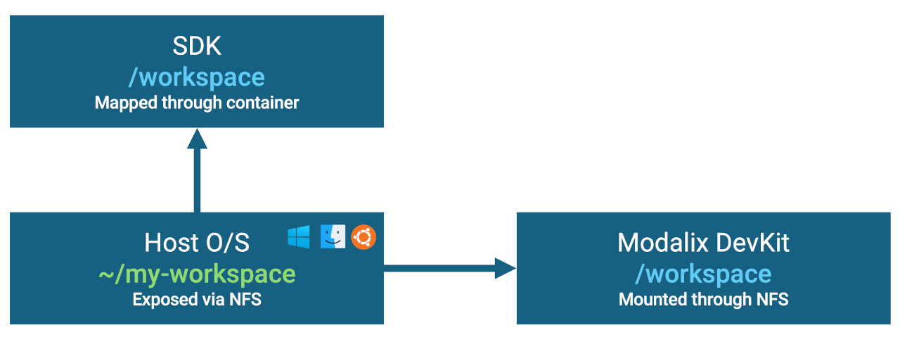

If you want a fast, agent-ready environment for building NEAT applications, use the NEAT eLxr SDK.

The NEAT eLxr SDK is built on top of the [open source SiMa eLxr SDK](https://github.com/SiMa-ai/swsoc-simaai-elxr-doc), with workflow-focused additions:

- Supports both x86 and arm64 container images, including native use on Mac without Rosetta overhead.
- Build cycles are typically about 5-10x faster than building directly on a Modalix DevKit.
- Supports the DevKit-Sync feature so human and coding agent can cross-compile and run DevKit binaries from the SDK shell without switching context.
- Ships with preinstalled Codex skills and preinstalled latest `main` branch source references for `core` and `apps`.

This setup makes it possible to run end-to-end agentic workflows from a single prompt, including build and run loops against a paired DevKit.

NEAT eLxr SDK source code is available on GitHub at [sima-neat/elxr-sdk](https://github.com/sima-neat/elxr-sdk).

## Supported platforms

- Ubuntu 22.04 and 24.04 (through Docker Engine)
- macOS 15.5 or above (through [Colima](https://github.com/abiosoft/colima))
- Windows 11 (through [WSL](https://learn.microsoft.com/en-us/windows/wsl/install) and Docker Engine)

## Prerequisites

- Your host machine and DevKit must be on the same network and allow NFS setup.
- You should know your DevKit IP address.

## Install and setup

1. Install the NEAT eLxr SDK:

```bash
sima-cli install ghcr:sima-neat/elxr
```

:::note Host setup notes
Host-specific setup details are documented in Reference:

- [Windows Host Notes](../../reference/elxr-sdk-host-setup/windows)
- [macOS Host Notes](../../reference/elxr-sdk-host-setup/macos)
:::

2. Setup the SDK and pair with your DevKit:

```bash
sima-cli sdk setup --devkit {devkit-ip}
```

During setup:

- Select container `ghcr.io-sima-neat-elxr-latest` if multiple SDK containers are present.
- Enter host admin password when prompted (NFS server setup on host).
- Enter DevKit `sima` password (`edgeai`) when prompted (NFS client setup on DevKit).

When setup is successful, you should see output similar to:

```text
============================================================
  DevKit Connected
============================================================
  DevKit target : sima@192.168.91.221:22
  Mounted path  : /sdk-workspace
  Host export   : 192.168.74.48:/Users/joey/workspace

  You can now run DevKit binaries from this SDK shell:
    dk /workspace/<path-to-arm64-binary> [args...]
============================================================

__SIMA_DEVKIT_BOOTSTRAP_STATUS=sourced_no_dk
✅ DevKit bootstrap completed in container 'ghcr.io-sima-neat-elxr-latest' (interactive).

✅ All selected containers started successfully!
```

## File sharing model (Host, Container, DevKit)

The SDK setup workflow connects three environments:

1. Host
2. Container
3. DevKit

`sima-cli sdk setup` configures NFS so your host workspace is shared across all three:

- Host local workspace folder is exported through host NFS.
- That folder is mounted into the SDK container as `/workspace`.
- The same shared content appears on DevKit as `/sdk-workspace` through NFS.
- The name of the mounted/mapped folders such as `/workspace` and `/sdk-workspace` are default and can be changed during SDK setup process.



The diagram above shows how the same workspace is exposed across host, SDK container, and DevKit through NFS-backed volume mapping.

This setup gives a seamless workflow for build artifacts:

- artifacts produced in SDK are immediately visible to DevKit without an explicit deploy step
- agents can access interim files (logs, outputs, traces) generated while the app runs on DevKit
- humans and agents can inspect the same files from one workspace context

## `dk` helper (`devkit-run`)

The SDK includes the `dk` helper (also known as `devkit-run`) to run ARM64 executables from within the SDK shell.

When you invoke `dk`, the SDK offloads execution to the paired DevKit and handles path translation/normalization so file and path arguments passed from the SDK side resolve correctly on the DevKit side.

## VS Code workflow

1. Connect VS Code to `ghcr.io-sima-neat-elxr-latest` with [Dev Containers](https://marketplace.visualstudio.com/items?itemName=ms-vscode-remote.remote-containers). Install Dev Containers extension if needed.
2. In the container terminal, run the following command once so the SDK can retrieve assets such as prebuilt models:

```bash
sima-cli login
```

3. Install [Codex Extension](https://marketplace.visualstudio.com/items?itemName=openai.chatgpt) in VS Code and sign in.
4. Ask Codex what skills are available; when `NEAT` appears, environment setup is ready.

You can then use a prompt such as:

```text
Build a C++ app doing image classification with RESNET50 using SiMa NEAT framework, run it on the devkit until you get the result.
```

## SDK upgrade

To upgrade NEAT eLxr SDK to the latest version, rerun:

```bash
sima-cli install ghcr:sima-neat/elxr
```

## Next step

To install or update the framework/runtime itself (same flow for DevKit and SDK), continue to [NEAT Framework](./neat-framework.mdx).
