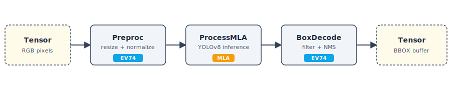

# Hello Neat!


*Detections written by the program below, drawn on the source image.*

This guide is your first real Neat inference: a small program that runs YOLOv8 on one image and prints decoded bounding boxes. Same program in Python and C++ — pick a language tab on each code block.

## Prerequisites

- A Modalix DevKit (3.0+) with Neat installed. See [Installation](/getting-started/installation).
- The `yolo_v8s` model archive:
  ```bash
  sima-cli modelzoo get yolo_v8s
  ```
- A test image — `coco_sample.jpg`:
  ```bash
  curl -L -o coco_sample.jpg "$SIMA_COCO_URL"
  ```
  If `SIMA_COCO_URL` is not set, see [how-to/assets_model_archives](/how-to/assets_model_archives#sample-images) for the canonical URL.

:::tip About `dk` / `devkit-run`
Inside the Neat SDK with a paired DevKit, prefix every run command with `dk`. See [Installation → Neat SDK](/getting-started/installation/neat-elxr-sdk).
:::

## Walk through the code

The program is seven short pieces. Switch the language tab on each block.

### 1. Read the image

<CodeTabs>
<CodeTab label="Python" lang="python">

```python
import cv2

bgr = cv2.imread("coco_sample.jpg")
rgb = cv2.cvtColor(bgr, cv2.COLOR_BGR2RGB)
```

</CodeTab>
<CodeTab label="C++" lang="cpp">

```cpp
#include <opencv2/opencv.hpp>

cv::Mat bgr = cv::imread("coco_sample.jpg");
cv::Mat rgb;
cv::cvtColor(bgr, rgb, cv::COLOR_BGR2RGB);
```

</CodeTab>
</CodeTabs>

OpenCV reads BGR; YOLOv8 expects RGB. This step is not Neat — your application gets pixels from a file, camera, or decoder; Neat enters at the next step.

### 2. Describe the pipeline

<CodeTabs>
<CodeTab label="Python" lang="python">

```python
import pyneat as neat

opt = neat.ModelOptions()
opt.preprocess.kind   = neat.InputKind.Image
opt.preprocess.preset = neat.NormalizePreset.COCO_YOLO
opt.decode_type       = neat.BoxDecodeType.YoloV8
opt.score_threshold   = 0.25
opt.nms_iou_threshold = 0.45
opt.top_k             = 100
```

</CodeTab>
<CodeTab label="C++" lang="cpp">

```cpp
#include <neat.h>
namespace neat = simaai::neat;

neat::Model::Options opt;
opt.preprocess.kind   = neat::InputKind::Image;
opt.preprocess.preset = neat::NormalizePreset::COCO_YOLO;
opt.decode_type       = neat::BoxDecodeType::YoloV8;
opt.score_threshold   = 0.25f;
opt.nms_iou_threshold = 0.45f;
opt.top_k             = 100;
```

</CodeTab>
</CodeTabs>

`ModelOptions` is one object that declares the whole shape of the pipeline — how the input is preprocessed, what inference contract to expect, and how the output is decoded.

| Field | What it sets |
|---|---|
| `preprocess.kind = Image` | Input is raw pixels, not a pre-shaped tensor. |
| `preprocess.preset = COCO_YOLO` | Resize + letterbox to model input, RGB, scale by `1/255`, no mean subtraction. |
| `decode_type = YoloV8` | Detection-head decoder family. |
| `score_threshold` | Drop boxes below this confidence. |
| `nms_iou_threshold` | NMS overlap threshold. |
| `top_k` | Keep at most this many boxes after NMS. |

### 3. Load the model

<CodeTabs>
<CodeTab label="Python" lang="python">

```python
model = neat.Model("yolo_v8s.tar.gz", opt)
```

</CodeTab>
<CodeTab label="C++" lang="cpp">

```cpp
neat::Model model("yolo_v8s.tar.gz", opt);
```

</CodeTab>
</CodeTabs>

`Model` reads the `.tar.gz`, validates its **MPK contract** (the model's self-description shipped inside the archive), reconciles that contract with the `ModelOptions` you passed, and instantiates the pipeline. Nothing has run yet.

### 4. Wrap your image as a `Tensor`

<CodeTabs>
<CodeTab label="Python" lang="python">

```python
tensor = neat.Tensor.from_numpy(rgb, copy=True, image_format=neat.PixelFormat.RGB)
```

</CodeTab>
<CodeTab label="C++" lang="cpp">

```cpp
neat::Tensor input = neat::Tensor::from_cv_mat(rgb, neat::PixelFormat::RGB);
```

</CodeTab>
</CodeTabs>

`Tensor` is Neat's typed data container — shape, dtype, layout, and the pixel format the framework needs to interpret the bytes. `from_numpy` / `from_cv_mat` wrap your host buffer; passing the `PixelFormat` is required so Neat knows the layout, not just the bytes.

### 5. Run inference

<CodeTabs>
<CodeTab label="Python" lang="python">

```python
outputs = model.run([tensor], timeout_ms=15000)
```

</CodeTab>
<CodeTab label="C++" lang="cpp">

```cpp
neat::TensorList outputs = model.run({input}, /*timeout_ms=*/15000);
```

</CodeTab>
</CodeTabs>

`model.run` is the synchronous push-pull: a `TensorList` of inputs in, a `TensorList` of outputs out — one tensor per model output. YOLOv8 has a single output: a packed `BBOX` buffer. For decoupled producer/consumer (live video), use the async path in [Run Inference Asynchronously](/tutorials/002-run-inference-async).

### 6. Decode the boxes

<CodeTabs>
<CodeTab label="Python" lang="python">

```python
decoded = neat.decode_bbox(outputs)
```

</CodeTab>
<CodeTab label="C++" lang="cpp">

```cpp
neat::TensorList decoded = neat::decode_bbox(outputs);
```

</CodeTab>
</CodeTabs>

`decode_bbox` is a `TensorList → TensorList` transform, positional 1:1 — `decoded[i]` is the decode of `outputs[i]`. Each output is a `float32` tensor of shape `[num_detections, 6]` with columns `(x1, y1, x2, y2, score, class_id)`. An input tensor that is not BBOX-format raises. For the underlying packed wire format, see [tutorial 006](/tutorials/006-read-detection-boxes).

### 7. Read the boxes

<CodeTabs>
<CodeTab label="Python" lang="python">

```python
labels = {0: "person", 27: "tie"}
for x1, y1, x2, y2, score, cls in decoded[0].to_numpy():
    name = labels.get(int(cls), f"id{int(cls)}")
    print(f"{name:<8} {score:.2f}  [{x1:4.0f} {y1:4.0f} {x2:4.0f} {y2:4.0f}]")
```

</CodeTab>
<CodeTab label="C++" lang="cpp">

```cpp
const neat::Tensor& boxes = decoded.front();      // [num_detections, 6] float32
auto m = boxes.storage->map(neat::MapMode::Read);
const float* d = static_cast<const float*>(m.data);
for (int64_t i = 0; i < boxes.shape[0]; ++i) {
  const float* r = d + i * 6;                     // x1 y1 x2 y2 score class_id
  const int cls = static_cast<int>(r[5]);
  const char* name = (cls == 0) ? "person" : (cls == 27) ? "tie" : "?";
  std::printf("%-8s %.2f  [%4.0f %4.0f %4.0f %4.0f]\n", name, r[4], r[0], r[1], r[2], r[3]);
}
```

</CodeTab>
</CodeTabs>

In Python the decoded tensor reads as an `[N, 6]` NumPy array via `to_numpy()`. In C++ you map the tensor and read the floats. The model emits COCO class IDs; mapping them to display names is on the application.

## What Neat assembled



Behind `model.run`, Neat built and ran a three-stage pipeline of `Node`s:

- **Preproc** — resize, letterbox, and normalize on EV74. Driven by `preprocess.preset = COCO_YOLO`.
- **ProcessMLA** — quantized YOLOv8 inference on the MLA. The kernels and weights came from the `.tar.gz`.
- **BoxDecode** — confidence filter + NMS on EV74. Driven by `decode_type = YoloV8` and the threshold knobs.

`Model` is the simplest entry point in Neat. Under the hood it builds a `Graph` of `Node`s and runs it. When your application needs more — wiring custom `Node`s, branching, async `push` / `pull`, multiple sources or sinks — you assemble the `Graph` yourself. See [Build an Inference Pipeline](/tutorials/003-build-inference-pipeline) for that path.

## Full program

<CodeTabs>
<CodeTab label="Python" lang="python">

`first_inference.py`:

```python
import cv2
import pyneat as neat

bgr = cv2.imread("coco_sample.jpg")
rgb = cv2.cvtColor(bgr, cv2.COLOR_BGR2RGB)

opt = neat.ModelOptions()
opt.preprocess.kind   = neat.InputKind.Image
opt.preprocess.preset = neat.NormalizePreset.COCO_YOLO
opt.decode_type       = neat.BoxDecodeType.YoloV8
opt.score_threshold   = 0.25
opt.nms_iou_threshold = 0.45
opt.top_k             = 100

model   = neat.Model("yolo_v8s.tar.gz", opt)
tensor  = neat.Tensor.from_numpy(rgb, copy=True, image_format=neat.PixelFormat.RGB)
outputs = model.run([tensor], timeout_ms=15000)
decoded = neat.decode_bbox(outputs)

labels = {0: "person", 27: "tie"}
for x1, y1, x2, y2, score, cls in decoded[0].to_numpy():
    name = labels.get(int(cls), f"id{int(cls)}")
    print(f"{name:<8} {score:.2f}  [{x1:4.0f} {y1:4.0f} {x2:4.0f} {y2:4.0f}]")
```

</CodeTab>
<CodeTab label="C++" lang="cpp">

`main.cpp`:

```cpp
#include <neat.h>
#include <opencv2/opencv.hpp>
#include <cstdio>

namespace neat = simaai::neat;

int main() {
  cv::Mat bgr = cv::imread("coco_sample.jpg");
  cv::Mat rgb;
  cv::cvtColor(bgr, rgb, cv::COLOR_BGR2RGB);

  neat::Model::Options opt;
  opt.preprocess.kind   = neat::InputKind::Image;
  opt.preprocess.preset = neat::NormalizePreset::COCO_YOLO;
  opt.decode_type       = neat::BoxDecodeType::YoloV8;
  opt.score_threshold   = 0.25f;
  opt.nms_iou_threshold = 0.45f;
  opt.top_k             = 100;

  neat::Model model("yolo_v8s.tar.gz", opt);
  neat::Tensor input = neat::Tensor::from_cv_mat(rgb, neat::PixelFormat::RGB);
  neat::TensorList outputs = model.run({input}, /*timeout_ms=*/15000);
  neat::TensorList decoded = neat::decode_bbox(outputs);

  const neat::Tensor& boxes = decoded.front();      // [num_detections, 6] float32
  auto m = boxes.storage->map(neat::MapMode::Read);
  const float* d = static_cast<const float*>(m.data);
  for (int64_t i = 0; i < boxes.shape[0]; ++i) {
    const float* r = d + i * 6;                     // x1 y1 x2 y2 score class_id
    const int cls = static_cast<int>(r[5]);
    const char* name = (cls == 0) ? "person" : (cls == 27) ? "tie" : "?";
    std::printf("%-8s %.2f  [%4.0f %4.0f %4.0f %4.0f]\n", name, r[4], r[0], r[1], r[2], r[3]);
  }
}
```

`CMakeLists.txt`:

```cmake
cmake_minimum_required(VERSION 3.16)
project(first_inference LANGUAGES CXX)
set(CMAKE_CXX_STANDARD 20)

if(DEFINED ENV{SYSROOT} AND NOT "$ENV{SYSROOT}" STREQUAL "")
  list(APPEND CMAKE_PREFIX_PATH "$ENV{SYSROOT}/usr/lib/aarch64-linux-gnu")
endif()

find_package(SimaNeat REQUIRED CONFIG)
find_package(OpenCV  REQUIRED COMPONENTS core imgcodecs imgproc)

add_executable(first_inference main.cpp)
target_link_libraries(first_inference PRIVATE SimaNeat::sima_neat ${OpenCV_LIBS})
```

</CodeTab>
</CodeTabs>

## Run it

<CodeTabs>
<CodeTab label="Python" lang="python">

```bash
source ~/pyneat/bin/activate
python3 first_inference.py
```

</CodeTab>
<CodeTab label="C++" lang="cpp">

```bash
cmake -S . -B build -DCMAKE_BUILD_TYPE=Release && cmake --build build -j
./build/first_inference
```

</CodeTab>
</CodeTabs>

Expected output:

```text
person  0.87  [ 746   41 1138  712]
person  0.87  [ 153  201 1105  711]
tie     0.71  [ 437  435  530  718]
```

## Tune it, then work with the output

Lower the score threshold to surface weaker detections — this is the knob you'll
reach for most:

<CodeTabs>
<CodeTab label="Python" lang="python">

```python
opt.score_threshold = 0.10   # before building the Model
```

</CodeTab>
<CodeTab label="C++" lang="cpp">

```cpp
opt.score_threshold = 0.10f;  // before building the Model
```

</CodeTab>
</CodeTabs>

Because `decode_bbox` hands back a plain `[N, 6]` array (`x1, y1, x2, y2, score,
class_id`), the post-processing you'd otherwise hand-roll is one line of NumPy:

```python
boxes = neat.decode_bbox(model.run([tensor]))[0].to_numpy()

people    = boxes[boxes[:, 5] == 0]                 # keep class_id 0 (person)
confident = boxes[boxes[:, 4] >= 0.80]              # keep score >= 0.80
top3      = boxes[boxes[:, 4].argsort()[::-1][:3]]  # 3 highest-scoring, no loop
```

That's the reason the decoder returns tensors rather than objects: detections drop
straight into the array tooling you already use.

## Next steps

- [Run Inference Asynchronously](/tutorials/002-run-inference-async) — producer/consumer overlap with `push` / `pull`.
- [Build an Inference Pipeline](/tutorials/003-build-inference-pipeline) — wire a `Graph` of `Node`s by hand.
- [Reference: `ModelOptions`](/reference/pythonapi/modules/pyneat/ModelOptions), [`Tensor`](/reference/pythonapi/modules/pyneat/Tensor), [`Model`](/reference/pythonapi/modules/pyneat/Model).
