# Minimal



After installation, start here to confirm your Neat setup is wired correctly.

This page keeps the first run intentionally small: create a tiny app, confirm the headers/imports resolve and it builds, and run it on the DevKit to confirm the runtime responds. Once this works, continue to [Run an App](./run_an_app.md) to run a real model inside a small Graph application.

:::note Neat SDK Prerequisite
To run commands on the DevKit directly from inside the SDK (for example, `dk build/sima_neat_hello` or `dk hello_neat.py`), set up DevKit pairing first.

**Required setup:** [Pair the Neat SDK with a DevKit](/getting-started/installation/neat-elxr-sdk#pair-with-a-devkit)
:::

## Minimal application

Create a working directory for the example, then use the **Python / C++** tabs to follow your language. Your choice follows the site-wide language selector, so it stays consistent across the docs.

<CodeTabs>
<CodeTab label="Python" lang="python">

**Create the script:**

1. `hello_neat.py` imports `pyneat` and confirms the DevKit Python runtime is ready.

   ```python
   from pyneat import DeviceType

   def main():
       print("Hello from sima-neat")
       print("DeviceType.CPU =", DeviceType.CPU)

   if __name__ == "__main__":
       main()
   ```

2. Your working directory should look like this:

   ```bash
   sima-neat-hello/
   └── hello_neat.py
   ```

**Run:**

* **On the DevKit**
  ```bash
  source ~/pyneat/bin/activate
  python3 hello_neat.py
  ```
* **On the Neat SDK from host**
  ```bash
  dk hello_neat.py
  ```

:::note Python Runtime Location
`pyneat` is installed on the DevKit runtime side, even if you run the Neat installer from inside the Neat SDK container.

When you run `dk hello_neat.py`, `dk` executes the script on the paired DevKit using the DevKit `pyneat` environment.
:::

</CodeTab>
<CodeTab label="C++" lang="cpp">

**Create two files:**

1. `CMakeLists.txt` tells CMake how to build and link the app.

   ```cmake title="CMakeLists.txt"
   cmake_minimum_required(VERSION 3.16)
   project(sima_neat_hello LANGUAGES CXX)

   set(CMAKE_CXX_STANDARD 20)
   set(CMAKE_CXX_STANDARD_REQUIRED ON)
   set(CMAKE_CXX_EXTENSIONS OFF)

   # Supports both:
   # - DevKit/native installs (system paths)
   # - Cross builds with SYSROOT exported (SDK sysroot paths)
   if(DEFINED ENV{SYSROOT} AND NOT "$ENV{SYSROOT}" STREQUAL "")
     list(APPEND CMAKE_PREFIX_PATH
       "$ENV{SYSROOT}/usr"
       "$ENV{SYSROOT}/usr/lib"
       "$ENV{SYSROOT}/usr/lib/aarch64-linux-gnu"
     )
   endif()

   find_package(SimaNeat REQUIRED CONFIG)
   find_package(PkgConfig REQUIRED)
   pkg_check_modules(OPENCV REQUIRED IMPORTED_TARGET opencv4)

   add_executable(sima_neat_hello main.cpp)
   target_link_libraries(sima_neat_hello
     PRIVATE
       SimaNeat::sima_neat
       PkgConfig::OPENCV
   )
   ```

2. `main.cpp` contains the tiny Neat program.

   ```cpp title="main.cpp"
   #include <iostream>
   #include <pipeline/TensorCore.h>

   int main() {
     auto storage = simaai::neat::make_cpu_owned_storage(64);
     if (!storage) {
       std::cerr << "Failed to allocate CPU tensor storage\n";
       return 1;
     }
     std::cout << "Hello from sima-neat\n";
     return 0;
   }
   ```

3. Your working directory should look like this:

   ```bash
   sima-neat-hello/
   ├── CMakeLists.txt
   └── main.cpp
   ```

**Build the example:**

```bash
cmake -S . -B build -DCMAKE_BUILD_TYPE=Release
cmake --build build -j
```

**Run:**

* **On the DevKit**
  ```bash
  ./build/sima_neat_hello
  ```
* **On the Neat SDK from host**
  ```bash
  dk build/sima_neat_hello
  ```

</CodeTab>
</CodeTabs>

You should see:

```text
Hello from sima-neat
```

If the program builds, the imports resolve, and it prints the greeting, your Neat installation is ready.

:::tip About `dk` / `devkit-run`
`dk` (alias for `devkit-run`) is a shell function in the SDK container, defined in `~/devkit-sync.rc` and loaded by `~/.bashrc`.

Because it is a shell function, commands such as `which devkit-run` may return nothing in the SDK shell. Use `dk <file>` to execute a built binary or Python entry-point file on the paired DevKit.
:::

## Next

Once the minimal app works, continue with [Run an App](./run_an_app.md) to run a real object-detection model inside a small Graph application.
