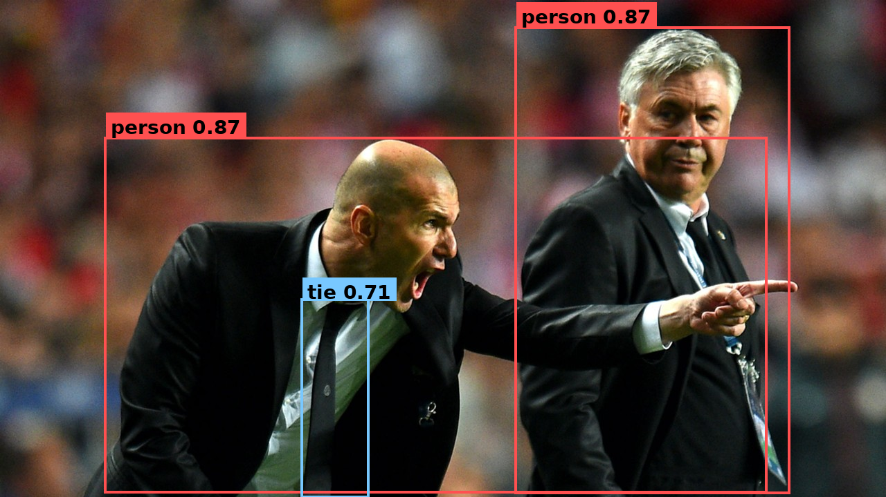
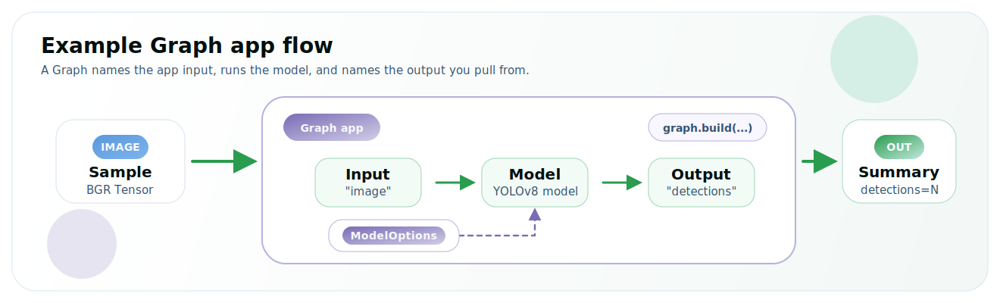

# Run an App



*Detections written by the program below, drawn on the source image.*

This is the same YOLOv8 inference as a small **application**: instead of calling `Model.run(...)` directly, you compose the model into a [`Graph`](/reference/programming-model/graph) — a named pipeline with an input, the model, and an output — then build it and push/pull. Same program in Python and C++; pick a language tab on each code block.

For this first app the shape is intentionally simple:

- A named _input_ (`nodes.input("image")`) marks where data enters the app.
- A _model_ (`graph.add(model)`) runs the model as one step in the pipeline.
- A named _output_ (`nodes.output("detections")`) marks where your application reads the result.



The same API scales to much more complex applications later; here the goal is the core composition pattern.

:::tip Pick your language
Use the **Python / C++** tabs on any code block — your choice follows the site-wide language selector, so every snippet and the full program switch together.
:::

## Set up the project

1. **Create an assets directory** for the model and the input image:
    ```bash
    mkdir -p assets
    ```
2. **Download the model:**
    ```bash
    sima-cli modelzoo -v 2.0.0 get yolo_v8s
    ```
    :::note sima-cli model download
    If `sima-cli` writes the model somewhere other than the `assets` directory, copy that file into `assets/yolo_v8s_mpk.tar.gz`.
    :::
3. **Download the sample image:**
    ```bash
    curl -L -o assets/tutorial_sample_image.png \
      https://docs.sima-neat.com/images/tutorial_sample_image.png
    ```

    You can also [open or download the sample image](../../images/tutorial_sample_image.png) from the docs.

## Walk through the code

The program is eight short pieces. Switch the language tab on each block.

### 1. Read the image

<CodeTabs>
<CodeTab label="Python" lang="python">

```python
import cv2

bgr = cv2.imread("assets/tutorial_sample_image.png")
rgb = cv2.cvtColor(bgr, cv2.COLOR_BGR2RGB)
```

</CodeTab>
<CodeTab label="C++" lang="cpp">

```cpp
#include <opencv2/opencv.hpp>

cv::Mat bgr = cv::imread("assets/tutorial_sample_image.png");
cv::Mat rgb;
cv::cvtColor(bgr, rgb, cv::COLOR_BGR2RGB);
```

</CodeTab>
</CodeTabs>

OpenCV reads BGR; YOLOv8 expects RGB. This step is not Neat — your application gets pixels from a file, camera, or decoder; Neat enters at the next step.

### 2. Describe the pipeline

<CodeTabs>
<CodeTab label="Python" lang="python">

```python
import pyneat as neat

opt = neat.ModelOptions()
opt.preprocess.kind   = neat.InputKind.Image
opt.preprocess.preset = neat.NormalizePreset.COCO_YOLO
opt.decode_type       = neat.BoxDecodeType.YoloV8
opt.score_threshold   = 0.25
opt.nms_iou_threshold = 0.45
opt.top_k             = 100
```

</CodeTab>
<CodeTab label="C++" lang="cpp">

```cpp
#include <neat.h>
namespace neat = simaai::neat;

neat::Model::Options opt;
opt.preprocess.kind   = neat::InputKind::Image;
opt.preprocess.preset = neat::NormalizePreset::COCO_YOLO;
opt.decode_type       = neat::BoxDecodeType::YoloV8;
opt.score_threshold   = 0.25f;
opt.nms_iou_threshold = 0.45f;
opt.top_k             = 100;
```

</CodeTab>
</CodeTabs>

`ModelOptions` declares the whole shape of the model pipeline in one object — how the input is preprocessed and how the detector output is decoded.

| Field | What it sets |
|---|---|
| `preprocess.kind = Image` | Input is raw pixels, not a pre-shaped tensor. |
| `preprocess.preset = COCO_YOLO` | Resize + letterbox to model input, RGB, scale by `1/255`, no mean subtraction. |
| `decode_type = YoloV8` | Detection-head decoder family. |
| `score_threshold` / `nms_iou_threshold` / `top_k` | Confidence floor, NMS overlap, and max boxes kept. |

### 3. Load the model

<CodeTabs>
<CodeTab label="Python" lang="python">

```python
model = neat.Model("assets/yolo_v8s_mpk.tar.gz", opt)
```

</CodeTab>
<CodeTab label="C++" lang="cpp">

```cpp
neat::Model model("assets/yolo_v8s_mpk.tar.gz", opt);
```

</CodeTab>
</CodeTabs>

`Model` reads the `.tar.gz`, validates its **MPK contract** against the `ModelOptions` you passed, and instantiates the model fragment. Nothing has run yet.

### 4. Wrap your image as a `Tensor`

<CodeTabs>
<CodeTab label="Python" lang="python">

```python
tensor = neat.Tensor.from_numpy(rgb, copy=True, image_format=neat.PixelFormat.RGB)
```

</CodeTab>
<CodeTab label="C++" lang="cpp">

```cpp
neat::Tensor input = neat::from_cv_mat(rgb, neat::ImageSpec::PixelFormat::RGB);
```

</CodeTab>
</CodeTabs>

`Tensor` is Neat's typed data container — shape, dtype, layout, and the pixel format the framework needs to interpret the bytes. Passing the `PixelFormat` is required so Neat knows the layout, not just the bytes.

### 5. Compose the Graph

<CodeTabs>
<CodeTab label="Python" lang="python">

```python
graph = neat.Graph("hello_neat_app")
graph.add(neat.nodes.input("image"))
graph.add(model)
graph.add(neat.nodes.output("detections"))
```

</CodeTab>
<CodeTab label="C++" lang="cpp">

```cpp
neat::Graph graph("hello_neat_app");
graph.add(neat::nodes::Input("image"));
graph.add(model);
graph.add(neat::nodes::Output("detections"));
```

</CodeTab>
</CodeTabs>

A `Graph` is the application pipeline. Each `add(...)` appends the next step, so this builds the linear flow `image → model → detections`. The model fragment from step 3 becomes one step inside it.

### 6. Build and run the Graph

<CodeTabs>
<CodeTab label="Python" lang="python">

```python
run = graph.build()
run.push("image", [tensor])
outputs = run.pull_tensors("detections")
```

</CodeTab>
<CodeTab label="C++" lang="cpp">

```cpp
neat::Run run = graph.build();
run.push("image", neat::TensorList{input});
neat::TensorList outputs = run.pull_tensors("detections");
```

</CodeTab>
</CodeTabs>

`build()` lowers the public graph into one executable runtime graph, preserving your node names. You then `push` inputs into named inputs and `pull` results from named outputs. `pull_tensors` returns a `TensorList` — the same shape `Model.run` would have produced — here the packed YOLOv8 `BBOX` output.

### 7. Decode the boxes

<CodeTabs>
<CodeTab label="Python" lang="python">

```python
decoded = neat.decode_bbox(outputs)
```

</CodeTab>
<CodeTab label="C++" lang="cpp">

```cpp
neat::TensorList decoded = neat::decode_bbox(outputs);
```

</CodeTab>
</CodeTabs>

`decode_bbox` is a `TensorList → TensorList` transform, positional 1:1. Each decoded output is a `float32` tensor of shape `[num_detections, 6]` with columns `(x1, y1, x2, y2, score, class_id)`.

### 8. Read the boxes

<CodeTabs>
<CodeTab label="Python" lang="python">

```python
labels = {0: "person", 27: "tie"}
for x1, y1, x2, y2, score, cls in decoded[0].to_numpy():
    name = labels.get(int(cls), f"id{int(cls)}")
    print(f"{name:<8} {score:.2f}  [{x1:4.0f} {y1:4.0f} {x2:4.0f} {y2:4.0f}]")
```

</CodeTab>
<CodeTab label="C++" lang="cpp">

```cpp
const neat::Tensor& boxes = decoded.front();      // [num_detections, 6] float32
auto m = boxes.storage->map(neat::MapMode::Read);
const float* d = static_cast<const float*>(m.data);
for (int64_t i = 0; i < boxes.shape[0]; ++i) {
  const float* r = d + i * 6;                     // x1 y1 x2 y2 score class_id
  const int cls = static_cast<int>(r[5]);
  const char* name = (cls == 0) ? "person" : (cls == 27) ? "tie" : "?";
  std::printf("%-8s %.2f  [%4.0f %4.0f %4.0f %4.0f]\n", name, r[4], r[0], r[1], r[2], r[3]);
}
```

</CodeTab>
</CodeTabs>

In Python the decoded tensor reads as an `[N, 6]` NumPy array via `to_numpy()`. In C++ you map the tensor and read the floats. The model emits COCO class IDs; mapping them to display names is on the application.

## Full program

Create the files in your project directory, then build and run.

<CodeTabs>
<CodeTab label="Python" lang="python">

`app.py`:

```python
#!/usr/bin/env python3
import sys

try:
    import pyneat as neat
except ImportError:
    sys.exit(
        "pyneat is not importable. Either Neat is not installed, or the venv is not activated.\n"
        "Run: source ~/pyneat/bin/activate"
    )

import cv2

LABELS = {0: "person", 27: "tie"}


def yolo_model_options():
    opt = neat.ModelOptions()
    opt.preprocess.kind   = neat.InputKind.Image
    opt.preprocess.preset = neat.NormalizePreset.COCO_YOLO
    opt.decode_type       = neat.BoxDecodeType.YoloV8
    opt.score_threshold   = 0.25
    opt.nms_iou_threshold = 0.45
    opt.top_k             = 100
    return opt


def main() -> int:
    bgr = cv2.imread("assets/tutorial_sample_image.png")
    if bgr is None:
        raise RuntimeError("failed to read assets/tutorial_sample_image.png")
    rgb = cv2.cvtColor(bgr, cv2.COLOR_BGR2RGB)

    model = neat.Model("assets/yolo_v8s_mpk.tar.gz", yolo_model_options())
    tensor = neat.Tensor.from_numpy(rgb, copy=True, image_format=neat.PixelFormat.RGB)

    # Compose the model into a Graph application: image -> model -> detections.
    graph = neat.Graph("hello_neat_app")
    graph.add(neat.nodes.input("image"))
    graph.add(model)
    graph.add(neat.nodes.output("detections"))

    # Build the app, push the image into the named input, pull the named output.
    run = graph.build()
    run.push("image", [tensor])
    outputs = run.pull_tensors("detections")

    decoded = neat.decode_bbox(outputs)
    for x1, y1, x2, y2, score, cls in decoded[0].to_numpy():
        name = LABELS.get(int(cls), f"id{int(cls)}")
        print(f"{name:<8} {score:.2f}  [{x1:4.0f} {y1:4.0f} {x2:4.0f} {y2:4.0f}]")
    print("[OK] Graph app completed")
    return 0


if __name__ == "__main__":
    raise SystemExit(main())
```

**Run:**

* **On the DevKit**
  ```bash
  source ~/pyneat/bin/activate
  python3 app.py
  ```
* **On the Neat SDK from host**
  ```bash
  dk app.py
  ```

</CodeTab>
<CodeTab label="C++" lang="cpp">

Create `CMakeLists.txt` and `main.cpp`:

```cmake title="CMakeLists.txt"
cmake_minimum_required(VERSION 3.16)
project(sima_neat_app LANGUAGES CXX)

set(CMAKE_CXX_STANDARD 20)
set(CMAKE_CXX_STANDARD_REQUIRED ON)
set(CMAKE_CXX_EXTENSIONS OFF)

# Supports both DevKit/native installs (system paths) and
# cross builds with SYSROOT exported (SDK sysroot paths).
if(DEFINED ENV{SYSROOT} AND NOT "$ENV{SYSROOT}" STREQUAL "")
  list(APPEND CMAKE_PREFIX_PATH
    "$ENV{SYSROOT}/usr"
    "$ENV{SYSROOT}/usr/lib"
    "$ENV{SYSROOT}/usr/lib/aarch64-linux-gnu"
  )
endif()

find_package(SimaNeat REQUIRED CONFIG)
find_package(PkgConfig REQUIRED)
pkg_check_modules(OPENCV REQUIRED IMPORTED_TARGET opencv4)

add_executable(sima_neat_app main.cpp)
target_link_libraries(sima_neat_app
  PRIVATE
    SimaNeat::sima_neat
    PkgConfig::OPENCV
)
```

```cpp title="main.cpp"
#include "neat.h"

#include <opencv2/imgcodecs.hpp>
#include <opencv2/imgproc.hpp>

#include <cstdint>
#include <cstdio>
#include <stdexcept>

namespace neat = simaai::neat;

neat::Model::Options yolo_model_options() {
  neat::Model::Options opt;
  opt.preprocess.kind   = neat::InputKind::Image;
  opt.preprocess.preset = neat::NormalizePreset::COCO_YOLO;
  opt.decode_type       = neat::BoxDecodeType::YoloV8;
  opt.score_threshold   = 0.25f;
  opt.nms_iou_threshold = 0.45f;
  opt.top_k             = 100;
  return opt;
}

int main() {
  cv::Mat bgr = cv::imread("assets/tutorial_sample_image.png");
  if (bgr.empty())
    throw std::runtime_error("failed to read assets/tutorial_sample_image.png");
  cv::Mat rgb;
  cv::cvtColor(bgr, rgb, cv::COLOR_BGR2RGB);

  neat::Model model("assets/yolo_v8s_mpk.tar.gz", yolo_model_options());
  neat::Tensor input = neat::from_cv_mat(rgb, neat::ImageSpec::PixelFormat::RGB);

  // Compose the model into a Graph application: image -> model -> detections.
  neat::Graph graph("hello_neat_app");
  graph.add(neat::nodes::Input("image"));
  graph.add(model);
  graph.add(neat::nodes::Output("detections"));

  // Build the app, push the image into the named input, pull the named output.
  neat::Run run = graph.build();
  run.push("image", neat::TensorList{input});
  neat::TensorList outputs = run.pull_tensors("detections");

  neat::TensorList decoded = neat::decode_bbox(outputs);
  const neat::Tensor& boxes = decoded.front();      // [num_detections, 6] float32
  auto m = boxes.storage->map(neat::MapMode::Read);
  const float* d = static_cast<const float*>(m.data);
  for (int64_t i = 0; i < boxes.shape[0]; ++i) {
    const float* r = d + i * 6;                     // x1 y1 x2 y2 score class_id
    const int cls = static_cast<int>(r[5]);
    const char* name = (cls == 0) ? "person" : (cls == 27) ? "tie" : "?";
    std::printf("%-8s %.2f  [%4.0f %4.0f %4.0f %4.0f]\n", name, r[4], r[0], r[1], r[2], r[3]);
  }
  std::printf("[OK] Graph app completed\n");
  return 0;
}
```

**Build:**

```bash
cmake -S . -B build -DCMAKE_BUILD_TYPE=Release
cmake --build build -j
```

**Run:**

* **On the DevKit**
  ```bash
  ./build/sima_neat_app
  ```
* **On the Neat SDK from host**
  ```bash
  dk build/sima_neat_app
  ```

</CodeTab>
</CodeTabs>

You should see one line per detection, then:

```text
[OK] Graph app completed
```

## What Neat assembled



The APIs map directly to that shape:

- `Graph` holds the application pipeline; `graph.add(...)` appends each step in order.
- The named input and output become the runtime endpoints: `run.push("image", ...)` and `run.pull_tensors("detections")`.
- `Model` is the same fragment you would call directly with `Model.run`; here it runs as one node inside the app.

## Next steps

For deeper graph composition, continue with the [Graph programming model](/reference/programming-model/graph).

From there, continue with broader SiMa Neat learning resources:

- Learn the [core programming model](/reference/programming-model/overview), which explains the main Neat concepts such as graphs, models, pipeline stages, and graph execution.
- Follow the [tutorials](/tutorials/), which walk through specific concepts and workflows step by step.
- Explore curated applications on the [apps portal](https://apps.sima-neat.com/portal), with source code in the [apps repository on GitHub](https://github.com/sima-neat/apps).
