# Run a Model

Use the same working directory from [Hello Neat!](./minimal) to run a real model for object detection.
This application loads a YOLOv8 model, reads a sample image, runs inference, decodes bounding boxes, and prints how many detections were found.

This page introduces two Neat concepts:

* [`Model`](/getting-started/development_workflow/model) loads the compiled model package and gives you the `run(...)` entry point.
* [`ModelOptions`](/tutorials/004-configure-model-options) tells Neat how to prepare the image and decode the detector output.

You do not need to master the full API yet; for now, focus on how `Model` and `ModelOptions` work together to run a compiled model.



## Get the model and a sample image

1. **Make an assets directory** where we will store the model and input image:
    ```bash
    mkdir -p assets
    cd assets
    ```
2. **Download the model:**
    ```bash
    sima-cli modelzoo -v 2.0.0 get yolo_v8s
    ```
    :::note sima-cli model download
    If `sima-cli` writes the model somewhere other than the `assets` directory, copy that file into `assets/yolo_v8s_mpk.tar.gz`.
    :::
3. **Download the sample image:**
    ```bash
    curl -L \
      -o tutorial_sample_image.png \
      https://docs.sima-neat.com/images/tutorial_sample_image.png
    ```

    You can also [open or download the sample image](../../images/tutorial_sample_image.png) from the docs.
4. **Return to your project directory:**
    ```bash
    cd ..
    ```

## Walkthrough

We build on the program from [Hello Neat!](./minimal): keep the same `CMakeLists.txt` (it already links Neat and OpenCV) and replace the program body with the four steps below. Each step is a small piece of the final program — read them in order, then grab the [full program](#full-program) to paste and run. Pick a language tab on any block; your choice follows the site-wide selector.

### 1. Load and resize the image {#step-load-image}

YOLOv8s expects a fixed `640×640` BGR image, so we read the sample with OpenCV and resize it. This is plain image I/O — no Neat APIs yet.

<CodeTabs>
<CodeTab label="C++" lang="cpp">

```cpp
cv::Mat load_sample_image() {
  cv::Mat bgr = cv::imread("assets/tutorial_sample_image.png", cv::IMREAD_COLOR);
  if (bgr.empty())
    throw std::runtime_error("failed to load sample image");
  cv::resize(bgr, bgr, cv::Size(640, 640));   // YOLOv8s input size
  return bgr;
}
```

</CodeTab>
<CodeTab label="Python" lang="python">

```python
def load_image(path: Path):
    bgr = cv2.imread(str(path), cv2.IMREAD_COLOR)
    if bgr is None:
        raise RuntimeError(f"failed to read image: {path}")
    return cv2.resize(bgr, (640, 640))   # YOLOv8s input size
```

</CodeTab>
</CodeTabs>

### 2. Describe the input and decoding with `ModelOptions` {#step-model-options}

`ModelOptions` is the runtime contract between your image and the model. It declares three things: the input **format and size**, the **normalization** to apply before inference (`preproc`), and how to **decode** the detector's raw output into boxes — `decode_type` selects the YOLOv8 decoder, the thresholds prune weak/overlapping boxes, `top_k` caps the count, and `original_width/height` map coordinates back to the source image.

<CodeTabs>
<CodeTab label="C++" lang="cpp">

```cpp
simaai::neat::Model::Options opt;
opt.format = "BGR";
opt.input_max_width = 640;
opt.input_max_height = 640;
opt.input_max_depth = 3;
opt.preproc.normalize = true;
opt.preproc.channel_mean = std::array<float, 3>{0.485f, 0.456f, 0.406f};
opt.preproc.channel_stddev = std::array<float, 3>{0.229f, 0.224f, 0.225f};
opt.decode_type = "yolov8";
opt.score_threshold = 0.55f;
opt.nms_iou_threshold = 0.5f;
opt.top_k = 100;
opt.original_width = 640;
opt.original_height = 640;
```

</CodeTab>
<CodeTab label="Python" lang="python">

```python
opt = pyneat.ModelOptions()
opt.format = "BGR"
opt.input_max_width = 640
opt.input_max_height = 640
opt.input_max_depth = 3
opt.decode_type = "yolov8"
opt.score_threshold = 0.55
opt.nms_iou_threshold = 0.5
opt.top_k = 100
opt.original_width = 640
opt.original_height = 640
opt.preproc.normalize = True
opt.preproc.channel_mean = [0.485, 0.456, 0.406]
opt.preproc.channel_stddev = [0.229, 0.224, 0.225]
```

</CodeTab>
</CodeTabs>

### 3. Load the model and run inference {#step-run}

Construct a `Model` from the compiled `.tar.gz` package and the options, then call `run(...)` with a timeout. It runs synchronously and returns a `Sample` holding the decoded output. The `timeout_ms` makes a stalled run fail loudly instead of hanging.

**C++** passes the `cv::Mat` straight to `run(...)`. **Python** first wraps the NumPy image as a `Tensor` (tagged `BGR` so Neat knows the byte layout), then runs it.

<CodeTabs>
<CodeTab label="C++" lang="cpp">

```cpp
simaai::neat::Model yolo("assets/yolo_v8s_mpk.tar.gz", opt);
simaai::neat::Sample output = yolo.run(bgr, /*timeout_ms=*/2000);
```

</CodeTab>
<CodeTab label="Python" lang="python">

```python
model = pyneat.Model(str(mpk), opt)
tensor = pyneat.Tensor.from_numpy(bgr, copy=True, image_format=pyneat.PixelFormat.BGR)
sample = model.run(tensor, timeout_ms=2000)
```

</CodeTab>
</CodeTabs>

### 4. Read the detection count {#step-read}

Because `decode_type` was set, the output is already decoded boxes. The BBOX tensor begins with a `uint32` detection count, so we read its first four bytes. (The full wire format — per-box coordinates, scores, and classes — is covered in [Read Detection Boxes from Model Output](/tutorials/006-read-detection-boxes).)

<CodeTabs>
<CodeTab label="C++" lang="cpp">

```cpp
std::uint32_t detections = 0;
if (output.tensor.has_value()) {
  simaai::neat::Mapping view = output.tensor->map_read();
  if (view.size_bytes >= sizeof(detections))
    std::memcpy(&detections, view.data, sizeof(detections));
}
std::cout << "detections=" << detections << "\n";
```

</CodeTab>
<CodeTab label="Python" lang="python">

```python
if sample.tensor is not None:
    payload = bytes(sample.tensor.to_numpy(copy=False))
    detections = struct.unpack_from("<I", payload, 0)[0] if len(payload) >= 4 else 0
    print(f"detections={detections}")
```

</CodeTab>
</CodeTabs>

## Full program {#full-program}

Keep the `CMakeLists.txt` from [Hello Neat!](./minimal) (it already links the app with Neat and OpenCV), and replace the program body with the complete file below. The highlighted lines are the core three: create the `Model`, build the input, and call `run()`.

<details>
<summary>Show the complete program</summary>

<CodeTabs>
<CodeTab label="C++" lang="cpp">

```cpp title="main.cpp" {43-45}
#include "neat.h"

#include <opencv2/imgcodecs.hpp>
#include <opencv2/imgproc.hpp>

#include <array>
#include <cstdint>
#include <cstring>
#include <iostream>
#include <stdexcept>
#include <string>

cv::Mat load_sample_image() {
  cv::Mat bgr = cv::imread("assets/tutorial_sample_image.png", cv::IMREAD_COLOR);
  if (bgr.empty())
    throw std::runtime_error("failed to load sample image");

  // YOLOv8s expects a 640 x 640 input in this tutorial.
  cv::resize(bgr, bgr, cv::Size(640, 640));
  return bgr;
}

int main() {
  // 1. Load the sample image and resize it for the model.
  cv::Mat bgr = load_sample_image();

  // 2. Tell Neat what input shape and YOLO post-processing to use.
  simaai::neat::Model::Options opt;
  opt.format = "BGR";
  opt.input_max_width = 640;
  opt.input_max_height = 640;
  opt.input_max_depth = 3;
  opt.preproc.normalize = true;
  opt.preproc.channel_mean = std::array<float, 3>{0.485f, 0.456f, 0.406f};
  opt.preproc.channel_stddev = std::array<float, 3>{0.229f, 0.224f, 0.225f};
  opt.decode_type = "yolov8";
  opt.score_threshold = 0.55f;
  opt.nms_iou_threshold = 0.5f;
  opt.top_k = 100;
  opt.original_width = 640;
  opt.original_height = 640;

  // 3. Load the compiled model package and run inference.
  simaai::neat::Model yolo("assets/yolo_v8s_mpk.tar.gz", opt);
  simaai::neat::Sample output = yolo.run(bgr, /*timeout_ms=*/2000);

  // 4. The BBOX output starts with a uint32 detection count.
  std::uint32_t detections = 0;
  if (output.tensor.has_value()) {
    simaai::neat::Mapping view = output.tensor->map_read();
    if (view.size_bytes >= sizeof(detections))
      std::memcpy(&detections, view.data, sizeof(detections));
  }
  std::cout << "detections=" << detections << "\n";
  std::cout << "[OK] YOLOv8 completed\n";
  return 0;
}
```

</CodeTab>
<CodeTab label="Python" lang="python">

```python title="hello_neat.py" {50-53}
#!/usr/bin/env python3
from __future__ import annotations

import struct
import sys
from pathlib import Path

try:
    import pyneat
except ImportError:
    sys.exit(
        "pyneat is not importable. Either Neat is not installed, or the venv is not activated.\n"
        "Run: source ~/pyneat/bin/activate"
    )

import cv2


def load_image(path: Path):
    bgr = cv2.imread(str(path), cv2.IMREAD_COLOR)
    if bgr is None:
        raise RuntimeError(f"failed to read image: {path}")
    # YOLOv8s expects a 640 x 640 input in this tutorial.
    return cv2.resize(bgr, (640, 640))


def main() -> int:
    mpk = Path("assets/yolo_v8s_mpk.tar.gz")
    image = Path("assets/tutorial_sample_image.png")

    # 1. Load the sample image and resize it for the model.
    bgr = load_image(image)

    # 2. Tell Neat what input shape and YOLO post-processing to use.
    opt = pyneat.ModelOptions()
    opt.format = "BGR"
    opt.input_max_width = 640
    opt.input_max_height = 640
    opt.input_max_depth = 3
    opt.decode_type = "yolov8"
    opt.score_threshold = 0.55
    opt.nms_iou_threshold = 0.5
    opt.top_k = 100
    opt.original_width = 640
    opt.original_height = 640
    opt.preproc.normalize = True
    opt.preproc.channel_mean = [0.485, 0.456, 0.406]
    opt.preproc.channel_stddev = [0.229, 0.224, 0.225]

    # 3. Load the compiled model package and run inference.
    model = pyneat.Model(str(mpk), opt)
    tensor = pyneat.Tensor.from_numpy(bgr, copy=True, image_format=pyneat.PixelFormat.BGR)
    sample = model.run(tensor, timeout_ms=2000)

    # 4. The BBOX output starts with a uint32 detection count.
    if sample.tensor is not None:
        payload = bytes(sample.tensor.to_numpy(copy=False))
        detections = struct.unpack_from("<I", payload, 0)[0] if len(payload) >= 4 else 0
        print(f"detections={detections}")
    else:
        print(f"raw_output_heads={len(sample.fields or [])}")

    print("[OK] YOLOv8 completed")
    return 0


if __name__ == "__main__":
    raise SystemExit(main())
```

</CodeTab>
</CodeTabs>

</details>

## Build and run

Run these from your project directory (the one containing `assets/`).

<CodeTabs>
<CodeTab label="C++" lang="cpp">

Rebuild with the same commands as Hello Neat!, then run the binary:

```bash
cmake -S . -B build -DCMAKE_BUILD_TYPE=Release
cmake --build build -j
./build/sima_neat_hello      # on the DevKit
dk build/sima_neat_hello     # from the Neat SDK host
```

</CodeTab>
<CodeTab label="Python" lang="python">

Run the script:

```bash
source ~/pyneat/bin/activate
python3 hello_neat.py        # on the DevKit
dk hello_neat.py             # from the Neat SDK host
```

</CodeTab>
</CodeTabs>

You should see a detection summary similar to:

```text
detections=3
[OK] YOLOv8 completed
```

The exact count can vary by model pack and runtime version. The important part is that the app builds, runs, and reaches `[OK] YOLOv8 completed`.

## What you built

This example follows the same high-level path used by larger Neat applications:

- Load a compiled model package (`.tar.gz`) as a `Model`.
- Convert the input image into the format the model expects.
- Run inference through Neat runtime stages.
- Decode raw detector output into bounding boxes.

For a deeper explanation of box decoding, thresholds, NMS, and detector output structure, continue with [Read Detection Boxes from Model Output](/tutorials/006-read-detection-boxes).

## Next Steps

Once YOLOv8 runs, continue with broader SiMa Neat learning resources:

- Continue to **[Run an App](./run_an_app)** to compose this same model into a `Graph` application — a named input → model → output pipeline you build once and drive with push/pull — instead of calling `Model.run(...)` directly.
- Learn the [core programming model](/getting-started/development_workflow/overview), which explains the main Neat concepts such as sessions, models, pipeline stages, and graph execution.
- Follow the [tutorials](/tutorials/), which walk through specific concepts and workflows step by step.
- Explore curated applications on the [apps portal](https://apps.sima-neat.com/portal), with source code in the [apps repository on GitHub](https://github.com/sima-neat/apps).
