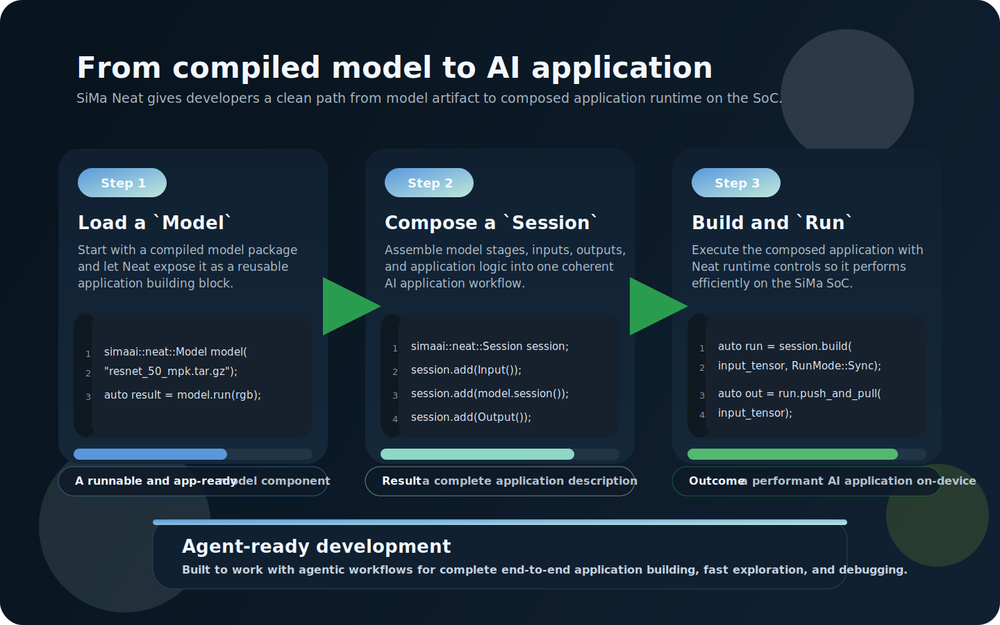
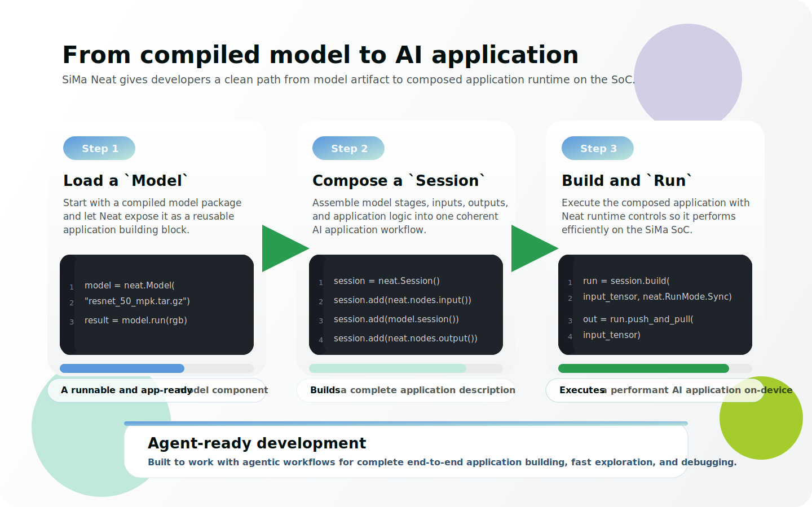
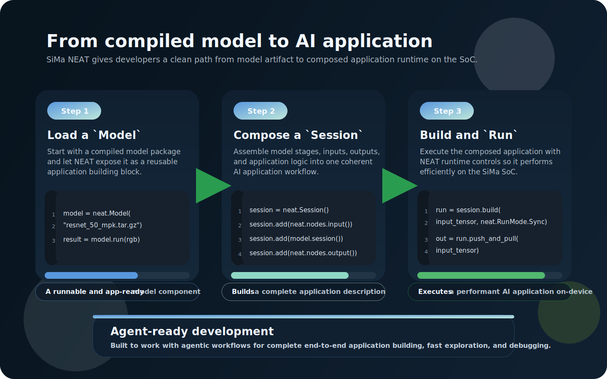

# SiMa Neat Overview

What Neat Is

SiMa Neat (**Neural Edge Acceleration Toolkit**) is an application-development framework for building and running AI applications on the SiMa platform.
It provides developers a set of Python and C++ APIs to execute and test compiled model artifacts (`tar.gz models`), compose AI applications that leverage the SoC's hardware blocks, and manage runtime execution. 

In the broader SiMa software ecosystem, Neat sits at the application layer, building on the SiMa runtime stack and using GStreamer-based execution underneath so developers can stay focused on application logic instead of manually stitching together lower-level runtime pieces.

How It Works

Neat gives you a direct mental model for that path. A compiled model archive (`.tar.gz`) becomes a `Model` component, application logic is assembled as a `Graph`, and that graph is built and executed as a `Run` object on the SoC. The same workflow is designed to work well with agentic development too, so teams can explore, build, and iterate faster.

<LanguageContent lang="cpp">

</LanguageContent>

<LanguageContent lang="py">

</LanguageContent>

The getting-started guides help you install and build Neat, the programming-model pages explain the main concepts in more detail, and the tutorials show how to apply them to real application patterns.

  <section class="overview-link-panel overview-link-panel-start">
    <h2>Start Here</h2>
    
Use these first steps to get Neat installed, built, and running with the core mental model in place.

    <ul class="overview-link-list">
      <li><a class="overview-link-card" href="/software/getting-started/installation/"><strong>Installation</strong>Choose the right setup path for DevKit or Neat SDK development.</a></li>
      <li><a class="overview-link-card" href="/software/getting-started/build/"><strong>Build</strong>Build the framework, docs, and optional Python bindings from source.</a></li>
      <li><a class="overview-link-card" href="/software/getting-started/minimal_example/"><strong>Hello Neat!</strong>Run your first Neat inference with YOLOv8 and decoded boxes.</a></li>
      <li><a class="overview-link-card" href="/software/getting-started/programming-model/overview/"><strong>Programming Model</strong>Learn the `Model`, `Graph`, and `Run` workflow in more detail.</a></li>
    </ul>
  </section>

  <section class="overview-link-panel overview-link-panel-explore">
    <h2>Explore</h2>
    
Once the basics are working, use the rest of the docs to deepen your understanding and move faster.

    <ul class="overview-link-list">
      <li><a class="overview-link-card" href="/software/tutorials/"><strong>Tutorials</strong>Follow guided examples that walk through real Neat application patterns.</a></li>
      <li><a class="overview-link-card" href="/software/how-to/runtime_tuning/"><strong>How-To Guides</strong>Jump into focused topics such as runtime tuning and practical workflows.</a></li>
      <li><a class="overview-link-card" href="/software/reference/cppapi/"><strong>Reference</strong>Browse the C++ API and supporting reference material.</a></li>
      <li><a class="overview-link-card" href="/software/contribute/architecture/"><strong>Contribute</strong>Understand the architecture, contributor expectations, and repo conventions.</a></li>
    </ul>
  </section>

