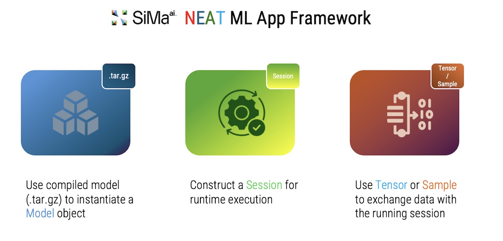

# SiMa NEAT Overview

SiMa NEAT (**Neural Edge Acceleration Toolkit**) is a framework for building, running, and debugging AI applications on SiMa platform using a stable, composable C++ and Python APIs and leveraging the benefits of GStreamer pipelines. 

NEAT provides a higher-level "pipeline-as-code" interface while keeping GStreamer's power and flexibility, with ML-friendly outputs (tensors) and reproducible configs. The goal is to deliver an API experience that makes it as easy as possible for developers to move from Nvidia-based applications to SiMa.

## Start Here

- [Install](getting-started/install)
- [Build](getting-started/build)
- [Hello SiMa](getting-started/minimal_example)
- [Programming Model](getting-started/programming-model/overview)

## Explore

- [Tutorials](tutorials)
- [How‑To Guides](how-to/runtime_tuning)
- [Reference](reference/cppapi)
- [Contribute](contribute/architecture)
